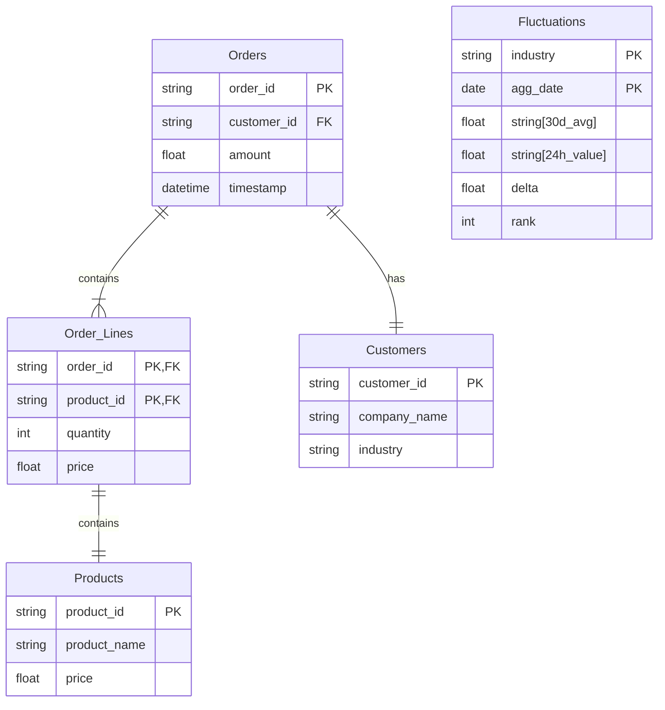

## Intro

## Table of contents


⚠️ This repo only contains the files I've changed since some of the files in the original repo were too big in size for GitHub.

## Reasoning


## Folder structure
I've tried to keep a structure similar to the one in the original repo. I've added an **infra** folder for the files tha where changed regarding infrastructure. **notebooks**, **spark-jobs-python**, and **spark-jobs-python** are self-explanatory and need only be copied into the original repo.

```
├── README.md
├── infra
├── notebooks
└── spark-jobs-python
```

## Changes made to infra:
- In **docker-compose.yml** I've changed the version of the mariadb image from *latest* to  *10.9.7*, as a fix for an error such as described [here](https://github.com/bitsondatadev/trino-getting-started/issues/31#issuecomment-1611865456).
- In order to create a location for checkpointing in structured streaming, in file **copy_to_minio.sh** I've added the following line: `mc mb minio/checkpoints --ignore-existing` . Besides that, I've also created separate paths for each type of data file (Orders, Industries, Customers, Products)


## Data Model

In order to solve the assignment, the only info we need is how much a customer spent in each order, there's no need for details regarding what the order contains nor the products ordered, as well as what industry corresponds to each costumer.

For the final table, where the aggregated info would be kept, I propose one where we can keep the industry, the ranking (from 1 to 3 in terms of fluctiation, where 1 is the one that had a bigger change in the last 24h compared to the previous 30d), the day it refers to and also the 30d avg, 24h value, and the delta.

In a real case scenario where we would store all of the data shared in the assignment I would propose the following:




## How does it work
### Customers batch flow
For the customer data, assuming this would be a CSV that gets uploaded from time to time, the ideal solution would be to have a service like AWS Lambda which would be triggered by new files in a certain bucket and process them.
In this case, the approach I've followed was to have a spark stream reading from the bucket, so that when a new file with data came into a specific folder, it would get processed. Then, I would save the data. For this, I've also created a new folder inside the **demo-data** bucket, as described in the infra section.

Another assumption made was that customers from the same company would operate on the same industries, e.g.

## Usage
There are three spark jobs used in my solution.
XX is used to consume the orders from Kafka and store them in their respective tables (`orders`, and `order_lines`), as well as keeping a raw_data history in binary format - as in a bronze-silver structure.

YY is used to update the Customer data. It keeps track of the files inserted in the data-demo/Customers/ path in Minio and processes each new file to update the data in the `customers` table.

ZZ is the aggregating job. It uses a stream on the orders table to keep track of both the 30 day average, as well as the 24h values, compare them, and store them in the `fluctuations` table.

These are started with 
```
spark sbmutigfvd osjfshighids sjfigsdf
```
In the *schema* folder I'm storing the schemas used for each dataframe as well as yaml files which provide the configuration for each of the tables.

Finally, there's a notebook in the **notebooks** folder which has an SQL snippet to generate the same data as the one in the aggregation job in case someone wants to do ad-hoc querying of the same style (e.g. comparing with the last 7 days instead of 30)

## Further considerations

If I had more time this is what I would do next:


Overall this was a fun challenge to make, but I found a lot of issues with infra. For quite some time I was having trouble connecting to the hive-metastore and since I was very time constrained (due to work and to the fact I requested the challenge on Monday , instead of further down the week to include the weekend) I'm not even sure how I ended up solving it. There some other issues, such as some trouble reading data from Kafka due to:

``````
Py4JJavaError: An error occurred while calling o235.start.
: org.apache.hadoop.ipc.RpcException: RPC response exceeds maximum data length
	at org.apache.hadoop.ipc.Client$IpcStreams.readResponse(Client.java:1936)
	at org.apache.hadoop.ipc.Client$Connection.receiveRpcResponse(Client.java:1238)
	at org.apache.hadoop.ipc.Client$Connection.run(Client.java:1134)
``````

Which I tried solving by adding the following line in **spark-defaults.conf**:
`spark.driver.maxResultSize              2g`.

For reference, these are the specs I'm using, in a 2021 MacBook Pro:
- macOS: Ventura 13.4
- Chip: Apple M1 Pro
- Memory: 16GB

And I'm using version 4.21.1 of Docket Desktop.
